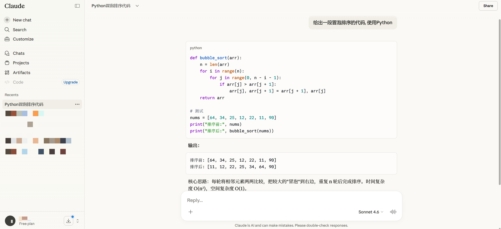

# Cherry Studio — Claude 风格主题

面向 [Cherry Studio](https://github.com/CherryHQ/cherry-studio) 的自定义 CSS，将界面配色对齐 **Claude 网页端** 的浅色 / 深色设计令牌（暖灰底、珊瑚色主色、蓝色链接等）。

本主题由 **Cursor+ Composer 2** 整理，**与 Anthropic / Claude 官方产品无关联**。

## 预览

| Cherry Studio（应用本主题） | Claude 官网（配色参考） |
| :---: | :---: |
|  |  |

## 特性

- 覆盖 Cherry Studio 常用 CSS 变量（背景、导航、聊天气泡、主色、链接、边框、状态色等）
- 浅色 / 深色主题分别适配
- 用户消息气泡使用与 Claude 浅色界面一致的 **`#F0EEE6`**（不透明，避免叠底偏色）
- 可选：通过文件内注释启用 **Anthropic Sans**（需联网加载官方字体文件）

## 使用方法

1. 安装并打开 Cherry Studio。
2. 进入 **设置 → 个性化 → 自定义 CSS**（路径以当前版本为准，亦可参见 [官方文档](https://docs.cherry-ai.com/pre-basic/personalization-settings/css)）。
3. 将本仓库中的 [`cherry-studio-claude-theme.css`](./cherry-studio-claude-theme.css) **全文**粘贴到自定义 CSS 编辑框并保存。
4. 在应用内切换 **浅色 / 深色** 主题各检查一遍显示是否正常。

### 可选字体

1. 默认加载Claude网页字体.

2. 若不加载外联字体，界面会使用系统无衬线字体栈。若需接近 Claude 网页的 **Anthropic Sans**，请打开 `cherry-studio-claude-theme.css`，按文件内说明取消相应 `@font-face` 与 `:root` 的注释；启用后需要能访问 Anthropic 的字体资源地址。

3. 预览图中使用的是:

   1. Cherry Studio**页面**的非衬线字体: Noto Sans SC. (设置 - 全局字体)

   2. 消息**代码块**字体: Maple Mono NF CN. (设置- 代码字体)

   3. 消息中的**英文和数字**等: Tiempos Text.

   4. 消息中的**中文**等: 方正FW筑紫A老明朝. 

      - 3, 4设置方法: 右上角消息设置图标中打开"使用衬线字体", 再在css样式最前添加: 

        ```css
        :root {
          --font-family-serif: 'Test Tiempos Text', '方正FW筑紫A老明朝 简', serif;
        }
        ```

        

## 文件说明

| 文件 | 说明 |
|------|------|
| `cherry-studio-claude-theme.css` | 可直接粘贴到 Cherry Studio 的完整样式 |
| `Cherry Studio截图.png` | README「预览」：应用本主题后的界面截图 |
| `Claude官网截图.png` | README「预览」：Claude 网页配色参考截图 |

## 配色与致谢

- 再次感谢 Cursor 与 Composer 2, 它们为生成此主题提供了几乎所有帮助!
- 配色逻辑参考从 Claude 网页样式中提取的 `[data-theme=claude]` 令牌及 `.hljs` 代码色思路。
- Cherry 侧变量命名与行为参考：[`cherry-studio` / `color.css`](https://github.com/CherryHQ/cherry-studio/blob/main/src/renderer/src/assets/styles/color.css)。

## 许可证

见仓库根目录 [LICENSE](./LICENSE)。
